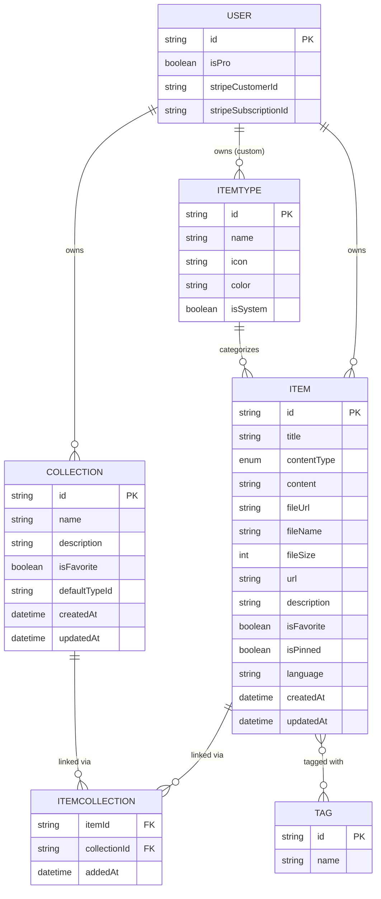
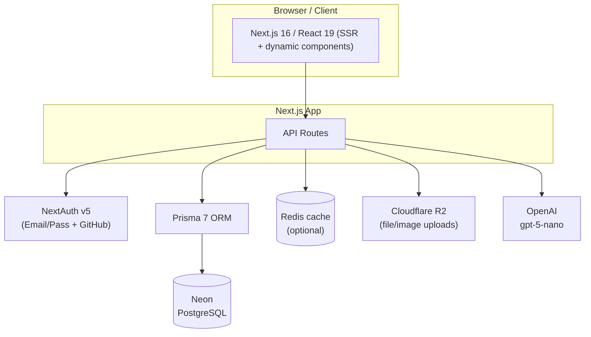

# DevStash — Project Overview

> One fast, searchable, AI-enhanced hub for all developer knowledge and resources.

DevStash gives developers a single home for the essentials they currently scatter across VS Code, Notion, AI chats, bookmarks, gists, and `.txt` files. Less context switching, less lost knowledge, more consistent workflows.

---

## Table of Contents

1. [The Problem](#the-problem)
2. [Target Users](#target-users)
3. [Features](#features)
4. [Data Model](#data-model)
5. [Prisma Schema](#prisma-schema)
6. [Architecture](#architecture)
7. [Tech Stack](#tech-stack)
8. [Monetization](#monetization)
9. [UI / UX](#ui--ux)
10. [Open Questions & Decisions](#open-questions--decisions)

---

## The Problem

Developers keep their essentials scattered across too many places:

| What | Where it lives today |
|------|----------------------|
| Code snippets | VS Code, Notion |
| AI prompts | Chat histories |
| Context files | Buried in projects |
| Useful links | Browser bookmarks |
| Docs | Random folders |
| Commands | `.txt` files, bash history |
| Project templates | GitHub gists |

The result is constant context switching, lost knowledge, and inconsistent workflows. **DevStash consolidates all of it into one searchable, AI-enhanced hub.**

---

## Target Users

- **Everyday Developer** — needs a fast way to grab snippets, prompts, commands, and links.
- **AI-first Developer** — saves prompts, contexts, workflows, and system messages.
- **Content Creator / Educator** — stores code blocks, explanations, and course notes.
- **Full-stack Builder** — collects patterns, boilerplates, and API examples.

---

## Features

### A. Items & Item Types

Every saved resource is an **item**. Items have a **type** that determines how they are stored and displayed. Users will eventually be able to create custom types, but launch ships with these fixed **system types** (not editable):

| Type | Storage kind | Pro only | Color | Icon | Route |
|------|-------------|:--------:|-------|------|-------|
| Snippet | text | — | `#3b82f6` 🟦 blue | `Code` | `/items/snippets` |
| Prompt | text | — | `#8b5cf6` 🟪 purple | `Sparkles` | `/items/prompts` |
| Note | text | — | `#fde047` 🟨 yellow | `StickyNote` | `/items/notes` |
| Command | text | — | `#f97316` 🟧 orange | `Terminal` | `/items/commands` |
| Link | url | — | `#10b981` 🟩 emerald | `Link` | `/items/links` |
| File | file | ✅ | `#6b7280` ⬜ gray | `File` | `/items/files` |
| Image | file | ✅ | `#ec4899` 🩷 pink | `Image` | `/items/images` |

**Storage kinds** map to how `contentType` is stored:

- **text** → `snippet`, `prompt`, `note`, `command` (stored in `content`)
- **url** → `link` (stored in `url`)
- **file** → `file`, `image` (stored in R2, referenced by `fileUrl`)

Items should be quick to create and access from a **drawer** rather than a full page navigation.

### B. Collections

Users can create collections that hold items of **any** type. An item can belong to **multiple** collections (a React snippet could live in both "React Patterns" and "Interview Prep") — this many-to-many relationship is handled via the `ItemCollection` join table.

Examples:

- **React Patterns** — snippets, notes
- **Context Files** — files
- **Python Snippets** — snippets

### C. Search

Powerful search across:

- Content
- Tags
- Titles
- Types

### D. Authentication

- Email / password
- GitHub OAuth (sign-in)

### E. Other Features

- Favorite collections and items
- Pin items to the top
- Recently used view
- Import code from a file
- Markdown editor for text types
- File upload for file types (`file` / `image`)
- Export data in multiple formats
- Dark mode (default for devs), light mode optional
- Add / remove items to / from multiple collections
- View which collections an item belongs to

### F. AI Features — **Pro only**

- AI auto-tag suggestions
- AI summaries
- "Explain this code"
- Prompt optimizer

Powered by OpenAI `gpt-5-nano`.

---

## Data Model

> This is a working draft — not set in stone.

### Entity Relationships



### Key relationships at a glance

- **User → Item / Collection / ItemType** — one-to-many (a user owns many of each).
- **ItemType → Item** — one-to-many. System types have `user = null` and `isSystem = true`.
- **Item ↔ Collection** — many-to-many via `ItemCollection` (with `addedAt` timestamp).
- **Item ↔ Tag** — many-to-many.

---

## Prisma Schema

> Targeting **Prisma 7** (latest). Fetch the current docs before finalizing — syntax and client generation have changed across recent major versions.

```prisma
// schema.prisma

generator client {
  provider = "prisma-client-js"
}

datasource db {
  provider = "postgresql"
  url      = env("DATABASE_URL")
}

enum ContentType {
  text
  url
  file
}

// Extends NextAuth's User model
model User {
  id                   String   @id @default(cuid())
  name                 String?
  email                String?  @unique
  emailVerified        DateTime?
  image                String?

  // Billing / plan
  isPro                Boolean  @default(false)
  stripeCustomerId     String?  @unique
  stripeSubscriptionId String?  @unique

  // Relations
  items                Item[]
  collections          Collection[]
  itemTypes            ItemType[]   // custom types only; system types have null user
  accounts             Account[]    // NextAuth
  sessions             Session[]    // NextAuth

  createdAt            DateTime @default(now())
  updatedAt            DateTime @updatedAt
}

model Item {
  id          String      @id @default(cuid())
  title       String
  contentType ContentType @default(text)

  // Content payload (one of these is used depending on contentType)
  content     String?     // text content (snippet, prompt, note, command)
  url         String?     // for link types
  fileUrl     String?     // R2 URL for file/image types
  fileName    String?     // original filename
  fileSize    Int?        // bytes

  description String?
  language    String?     // optional, for code highlighting
  isFavorite  Boolean     @default(false)
  isPinned    Boolean     @default(false)

  // Relations
  user        User             @relation(fields: [userId], references: [id], onDelete: Cascade)
  userId      String
  itemType    ItemType         @relation(fields: [itemTypeId], references: [id])
  itemTypeId  String
  collections ItemCollection[]
  tags        Tag[]            @relation("ItemTags")

  createdAt   DateTime @default(now())
  updatedAt   DateTime @updatedAt

  @@index([userId])
  @@index([itemTypeId])
}

model ItemType {
  id       String  @id @default(cuid())
  name     String
  icon     String  // lucide-react icon name, e.g. "Code"
  color    String  // hex, e.g. "#3b82f6"
  isSystem Boolean @default(false)

  // null for system types; set for user-created custom types
  user     User?   @relation(fields: [userId], references: [id], onDelete: Cascade)
  userId   String?

  items    Item[]

  @@index([userId])
}

model Collection {
  id            String   @id @default(cuid())
  name          String
  description   String?
  isFavorite    Boolean  @default(false)
  defaultTypeId String?  // default item type for new/empty collections

  user          User             @relation(fields: [userId], references: [id], onDelete: Cascade)
  userId        String
  items         ItemCollection[]

  createdAt     DateTime @default(now())
  updatedAt     DateTime @updatedAt

  @@index([userId])
}

// Join table: Item <-> Collection (many-to-many)
model ItemCollection {
  item         Item       @relation(fields: [itemId], references: [id], onDelete: Cascade)
  itemId       String
  collection   Collection @relation(fields: [collectionId], references: [id], onDelete: Cascade)
  collectionId String
  addedAt      DateTime   @default(now())

  @@id([itemId, collectionId])
  @@index([collectionId])
}

model Tag {
  id    String @id @default(cuid())
  name  String @unique
  items Item[] @relation("ItemTags")
}
```

> **Migrations only.** Never use `prisma db push` or modify the database structure directly. Create migrations, run them in dev, then promote to prod.

---

## Architecture



A single Next.js codebase serves SSR pages and hosts the API routes that talk to the database, file storage, and AI provider — keeping operational overhead low.

---

## Tech Stack

| Layer | Choice | Notes |
|-------|--------|-------|
| Framework | **Next.js 16 / React 19** | SSR pages with dynamic components; API routes for backend. One repo. |
| Language | **TypeScript** | Type safety across the stack. |
| Database | **Neon (PostgreSQL)** | Cloud Postgres. |
| ORM | **Prisma 7** | Latest — fetch current docs. Migrations only, never `db push`. |
| Cache | **Redis** *(maybe)* | For caching hot paths. |
| File storage | **Cloudflare R2** | File / image uploads. |
| Auth | **NextAuth v5** | Email/password + GitHub OAuth. |
| AI | **OpenAI `gpt-5-nano`** | Auto-tag, summaries, explain code, prompt optimizer. |
| Styling | **Tailwind CSS v4 + ShadCN UI** | Syntax highlighting for code blocks. |

> ⚠️ **Database rule:** NEVER use `db push` or update the DB structure directly. Always create migrations, run them in dev, then in prod.

---

## Monetization

Freemium model.

| | **Free** | **Pro** — $8/mo or $72/yr |
|---|---|---|
| Items | 50 total | Unlimited |
| Collections | 3 | Unlimited |
| System types | All except `file` / `image` | All |
| File & image uploads | ❌ | ✅ |
| Search | Basic | Full |
| Custom types | ❌ | ✅ *(coming later)* |
| AI auto-tagging | ❌ | ✅ |
| AI code explanation | ❌ | ✅ |
| AI prompt optimizer | ❌ | ✅ |
| Export (JSON / ZIP) | ❌ | ✅ |
| Support | Standard | Priority |

> 🛠️ **During development:** scaffold the Pro plumbing (flags, gating logic, Stripe IDs), but leave **all features unlocked for every user** until launch.

---

## UI / UX

### General

- Modern, minimal, developer-focused.
- **Dark mode by default**, light mode optional.
- Clean typography, generous whitespace.
- Subtle borders and shadows.
- Syntax highlighting for code blocks.
- **References:** Notion, Linear, Raycast.

### Screenshots

Use the screenshots below as a reference for the dashboard UI. An exact match isn't required:

- @context/screenshots/dashboard-ui-main.jpeg
- @context/screenshots/dashboard-ui-drawer.jpeg

### Layout

- **Sidebar + main content**, collapsible sidebar.
- **Sidebar:** item types (Snippets, Commands, etc.) linking to their item lists, plus latest collections.
- **Main:** grid of color-coded **collection cards** (background color set by the type the collection holds most of). Items display beneath collections as color-coded cards (border color by type).
- **Items open in a quick-access drawer.**

### Type Colors & Icons

| Type | Color | Icon |
|------|-------|------|
| Snippet | `#3b82f6` (blue) | `Code` |
| Prompt | `#8b5cf6` (purple) | `Sparkles` |
| Command | `#f97316` (orange) | `Terminal` |
| Note | `#fde047` (yellow) | `StickyNote` |
| File | `#6b7280` (gray) | `File` |
| Image | `#ec4899` (pink) | `Image` |
| Link | `#10b981` (emerald) | `Link` |

### Responsive

- Desktop-first, but mobile usable.
- Sidebar collapses to a drawer on mobile.

### Micro-interactions

- Smooth transitions.
- Hover states on cards.
- Toast notifications for actions.
- Loading skeletons.

---

## Open Questions & Decisions

A few things from the notes worth nailing down before/early in build:

- **`contentType` enum vs. storage kind** — the notes list `contentType (text | file)` on `Item` but also describe `url` as a distinct kind for links. The schema above uses a three-value enum (`text | url | file`). Confirm this is the intended split, or whether links should just be `text` with a populated `url` field.
- **Redis** — marked "maybe." Decide whether it's in for launch or deferred; affects infra setup.
- **Tag ownership** — `Tag` currently has no user relation, so tags are global/shared. If tags should be per-user, add a `userId` relation (and adjust the `@unique` on `name` to `@@unique([userId, name])`).
- **Custom types** — Pro feature explicitly "coming later." `ItemType` already supports it via nullable `user`, so no schema change needed when it lands.
- **Export formats** — JSON for data, ZIP for files/images. Confirm scope (everything vs. per-collection export).

---

*Draft overview — refine as the build progresses.*
